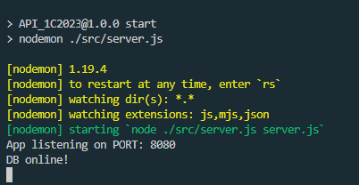
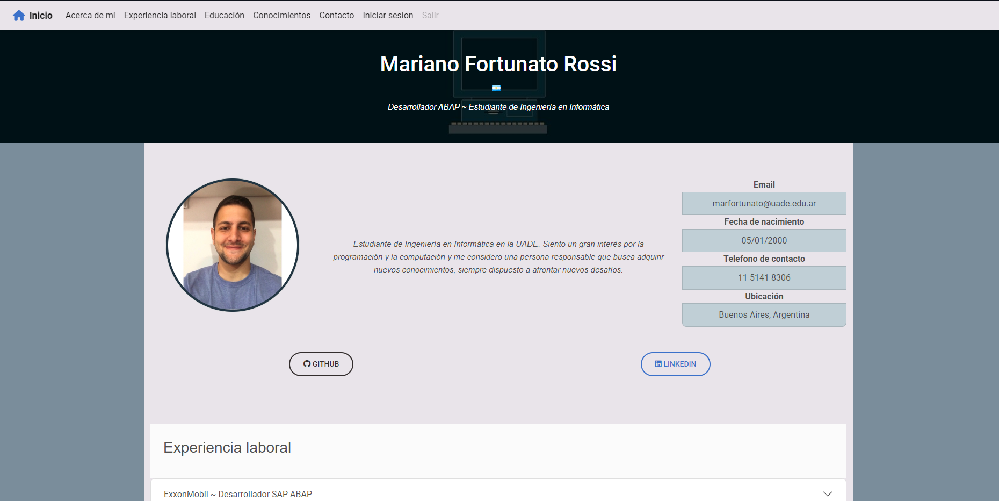
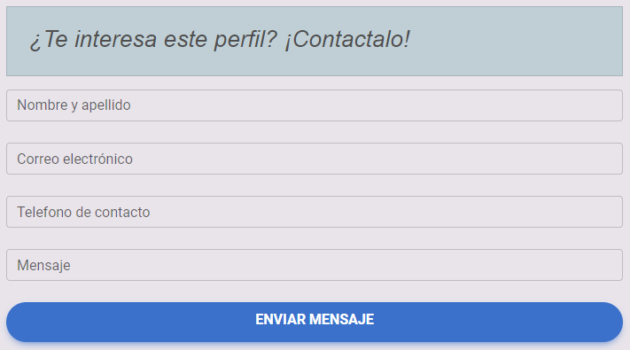
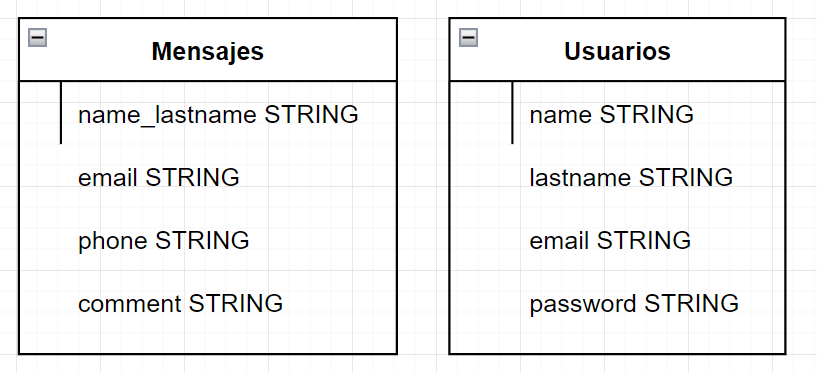

# TPO - Aplicaciones Interactivas - DEVELOPER PORTFOLIO

# Tabla de Contenidos

1. [Integrantes](#integrante)
2. [Introduccion](#introduccion)
3. [Requerimientos](#requerimientos)
4. [Instalacion](#instalacion)
5. [Funcionalidades](#funcionalidades)
6. [Estructuras](#estructuras)
7. [Documentacion de Postman](#documentacion-de-postman)

# Integrante

## Mariano Fortunato Rossi - 1135771

# Introduccion

En el presente documento se proporcionara una lista de detalles sobre la implementación de una aplicación web que permitira a los clientes gestionar el portfolio de un profesional de sistemas utilizando las herramientas aprendidas durante la cursada de la materia 'Aplicaciones interactivas'. Se hará mención de las tecnologias seleccionadas para la elaboración del proyecto junto con la funcionalidad ofrecida y los requerimientos necesarios para garantizar el correcto funcionamiento de los servicios de manera local.

# Requerimientos

Para poder instalar y utilizar la aplicacion web se necesitara lo siguiente:
* Frontend: lenguajes y librerías de HTML/CSS, React, JavaScript y NodeJS.
* Backend: lenguajes y librerías en JavaScript , NodeJS y Mongoose.
* Base de datos: NoSQL en MongoDB.

# Instalacion

## Instalación para el BackEnd

Nos dirigimos hacia la carpeta 'backend' y ejecutamos la siguiente serie de comandos desde una terminal:
```
$ npm install -g nodemon
$ npm start
```
Si la ejecución resulta correcta, se abrirá mostrara el siguiente mensaje desde la terminal:



## Instalación para el FrontEnd

Nos dirigimos hacia la carpeta 'front' y ejecutamos la siguiente serie de comandos desde una terminal:
```
$ npm install
$ npm start
```
Si la ejecución resulta correcta, se abrirá un navegador donde podremos ver la aplicación web como muestra la siguiente imagen:




# Funcionalidades

## Portfolio

La aplicación permite al profesional mostrar la siguiente información:
* Acerca de mi
* Experiencia laboral
* Educacion
* Conocimientos
* Contacto

Adicionalmente, se le permite al mismo la funcionalidad para iniciar sesion y/o registrarse dentro de la seccion:
* Iniciar sesion


## Contacto

Se le permite a los reclutadores interesados en el perfil del usuario a traves del formulario de contacto completando los siguientes datos:

* Nombre y apellido
* Dirección email
* Teléfono de contacto
* Mensaje



## Visualización de contactos interesados

El sistema permite al profesional consultar las personas que quieren contactarse. Para ello el sistema ofrece una pantalla en donde el profesional deberá autenticarse y, una vez que la sesion es validada, se le mostrará una tabla con los contactos y sus respectivos mensajes. La duración de la sesion sera de 1 (una) hora y luego el token de acceso expirará, invalidando la sesion en curso.

# Estructuras

En la siguiente imagén podemos ver las dos estructuras que serán utilizadas en el servicio para proporcionar la funcionalidad de inicio de sesion y envio y consulta de mensajes.



# Documentacion-de-postman

Se proporciona un enlace a la documentación proporcionada a traves de PostMan para los endpoints utilizados por el proyecto.

https://documenter.getpostman.com/view/28169914/2s93z9chsk
